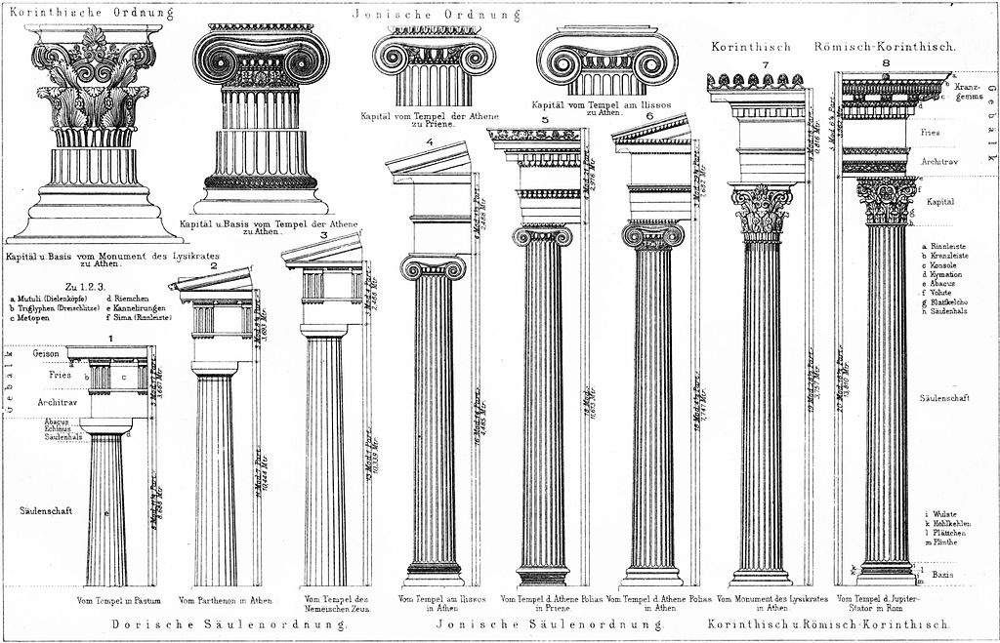
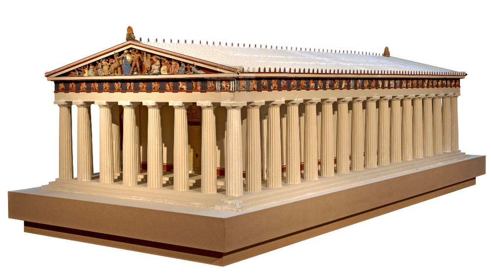

# Temple Generator

The Temple Generator enables you to recreate ancient greek temples or create your very own. It follows the design principles of the Doric order, but it's procedural nature allows the temple to also become free of them.  

## Concept

The religion of the ancient greeks was a form of nature worship. They adored the beauty of the natural world around them and drew their inspiration for the arts from it. It's probably easiest to recognize in theiir architecture, more specifically in the design of the temples' columns.

The columns resemble tree trunks. They shrink the higher they grow, have "cuts" in their outer layer like trees have in their bark and end in a "leafy" treetop, as most clearly seen in the columns of the Corinthian order. This adaption of nature through architectural means intrigued me. The greeks combined stones and tools to approximate nature, while also creating means to escape from it into cultural habitats. I want to combine electrons and algorithms to approximate the greekk architecure approximating nature, while also creating means to escape our time-bound reality rendering the original ancient rchitecture long gone.

I see this as further abstracting nature like the greek architects into something existing very distant from it, while also being havily influenced by it. By creating a generator for ancient greek temples, it's not only possible to recreate the destroyed architecture of the Pantheon, but also to imagine buildings that could have been. Fiction becomes reality and vice-versa.

## Implementation

I used Houdini and it's procedural architecture to realize the project. To keep the task in the given time scope, I chose to only focus on the Doric order so far and try to be able to generate the Pantheon. As a starting point I followed [this tutorial](https://chaotickeyframes.home.blog/2019/11/03/naive-doric-shaft/) to get my columns going with their shaft.

The idea is to create the temple in two steps:
1. Model a template for the columns
2. Design the temple itself and use the template to copy the columns at the needed positions

The paramterized shaft of the columns was created after said tutorial: One Circle represents the maximum radius of the shaft is subtracted by smaller circles around it and then extruded. Both ends of the column are created through combining a simple script for generating two dimensional geometry following the path of a ramp parameter with a revolve node extruding it into three dimensions.

For the temple itself I got stuck for a while trying to paramterize the stairs leading up to the foundation and resorted to creating a simple "ramp" leading up for now through VEX. To clone the columns into place I used two grids, one for the wide and one for the deep columns to maximize the freedom a user has. The roof consists of two parts: One blocky foundation made out of a simple box and the triangularly shaped top. For the top I create geometry with VEX and extrude it. To set the center of the front apart and "extrude" it inwards, I subtract a smaller top set in the middle from it, just leaving the rim. Then I copied the little details of the roof onto the roof's points. I also tried a similiar technique to tile the roof, [but I still need to work on that](problem_rooftiles.PNG).

## Results

The generator actually works quite well to generate temples of the Doric order, albeit rather simple geomtry. Pretty much everything is paramterized and enables the user to rapidly create different looking temples.

_Video of the generator in action!_

## Project Reflection & Discussion

The columns could be more flexible. They are great for creating really round pofiles, but can't yet become more blocky, especially at verying parts of e.g. a column's end. This is important for the Pantheon as you can see.

Also stairs leading up to the temple as well as to the inner part of it need to be implemented for the generator to be true to the Greeks' architectural philosphy. 

As planned for the timespan, the generator is only able to create temples of the Doric order. I already got started with top ends for the columns of the Ionic order, but wasn't able to finalize them. The complete generator should obviously be able to create geomtry in and combine all the different orders.

The roof works so far, but needs to become a lot more detailled. I'm also thinking about modeling a couple of statues and wall embossements for the user to decorate the temple with.

## Lessons Learned

When working procedurally there are hundreds of ways that lead to the more or less the same result. So after looking at two or three tutorials which had totally different approaches, I chose to find a way that I am most comfortable with. For me that meant using Attribute Wrangles to generate two dimensional geometry and then use different nodes to extrude it.

Also when using relative references, it's important to note that these update when used as expressions in UI elements, but not in VEX scripts. I had to learn that the hard way near the end of the project.